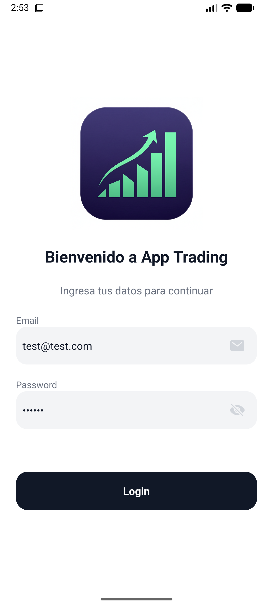
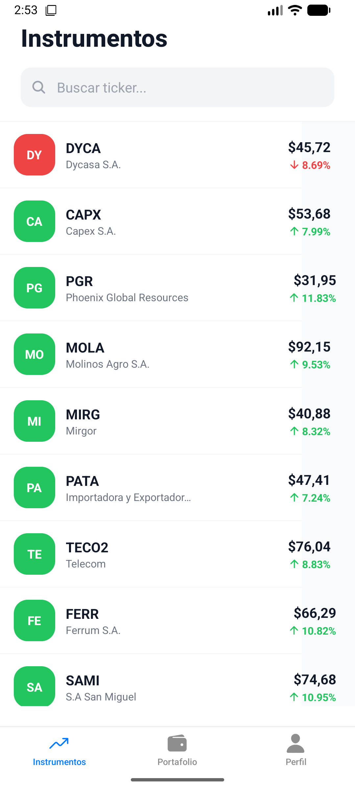
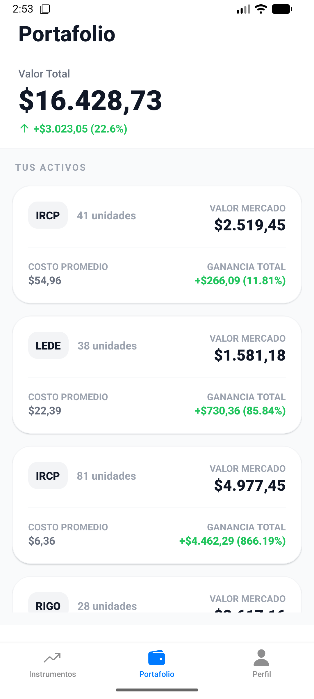
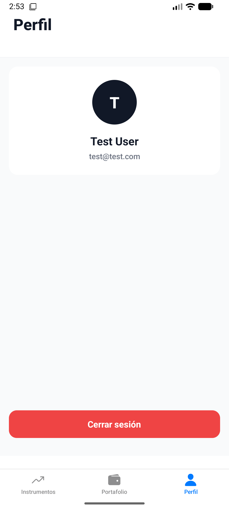
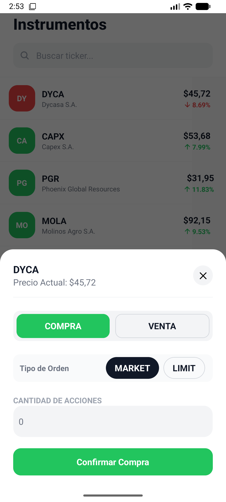
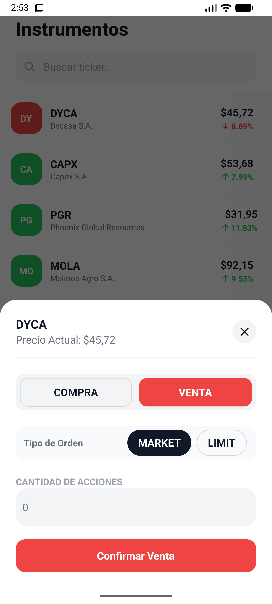

# AppTrading
Aplicación móvil de trading desarrollada con React Native para Android Permite visualizar instrumentos financieros, gestionar portafolios y realizar operaciones de compra/venta.

## Capturas de Pantalla

| Login | Instrumentos | Portfolio |
|-------|--------------|-----------|
|  |  |  |

| Perfil | Orden Compra | Orden Venta |
|--------|--------------|-------------|
|  |  |  |

---

> **Nota:** Esta aplicación ha sido desarrollada y probada principalmente en **Android**. La configuración de iOS está disponible pero no ha sido verificada completamente.

### Entorno de Pruebas Verificado

| Componente | Especificación |
|------------|----------------|
| **Plataforma** | Android |
| **Emulador** | Medium Phone API 36.1 |
| **Sistema Operativo** | Android 16.0 ("Baklava") |
| **Arquitectura** | arm64 |
| **Tipo** | Virtual Device (AVD) |

---

## Documentación

| Sección | Descripción |
|---------|-------------|
| [Requisitos Previos](docs/REQUISITOS.md) | Configuración del entorno de desarrollo (Node.js, Android Studio, Xcode, etc.) |
| [Inicio Rápido](docs/INICIO-RAPIDO.md) | Instalación, ejecución, credenciales de prueba y capturas de pantalla |
| [Arquitectura del Proyecto](docs/ARQUITECTURA.md) | Estructura de carpetas, ventajas y sistema de mocks |
| [Referencia](docs/REFERENCIA.md) | Scripts disponibles, tecnologías y herramientas de desarrollo |
